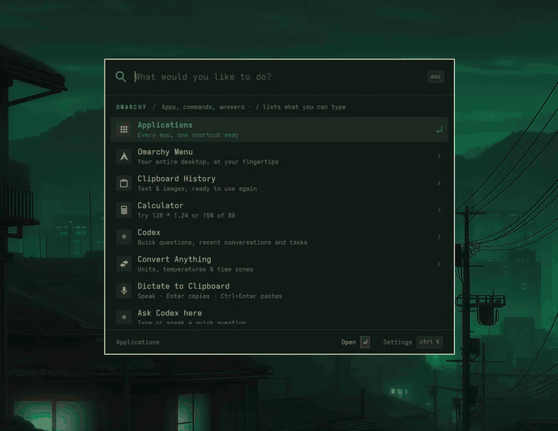

# Nixarchy Plugin Browser + Auditor

**[The site and manual](https://olafkfreund.github.io/nixarchy-plugin-browser/)** ·
on nixarchy it is *Setup ▸ Plugins ▸ Add Plugin*.

[](https://olafkfreund.github.io/nixarchy-plugin-browser/)

A fork of the Omarchy Plugin Browser for **nixarchy** (Omarchy on NixOS). It
uses NixOS paths throughout and does not run on Arch Omarchy.

Browse the Omarchy plugin marketplace from a terminal, and **audit any plugin in
a sandbox before it touches your shell**.

Omarchy shell plugins run as **unsandboxed code inside the long-lived
`omarchy-shell` process**, with everything your user account can reach
(`$OMARCHY_PATH/shell/README.md`). `omarchy plugin add` clones a repo,
validates its manifest, and lands it **disabled** so you can read it first — but
it clones whatever is at the repo's mutable `HEAD`. The marketplace verifies an
*exact commit*, and its own docs are explicit that the install command is **not
commit-bound** (`VERIFICATION.md` → "Installation boundary"). This tool closes
that gap: it clones into a throwaway sandbox, pins the checkout to the
marketplace's **verified** commit, statically scans it, and only then — if you
ask — hands that reviewed checkout to `omarchy plugin add`.

## What you get

| Tool | What it does |
|------|--------------|
| `omarchy-plugin-browser` | Searchable TUI over the live marketplace catalog (`plugins.omarchy.org`). Never runs marketplace code — it reads names, authors, tags, verification status, and the install command as plain text. |
| `omarchy-plugin-audit` | Clones a plugin into a `bwrap` sandbox with no network and an empty home, pins to the verified commit, greps for hostile patterns, runs the shell's own manifest validator, and prints a verdict. Optionally installs the vetted checkout (disabled). |
| `nixarchy-plugin-fix` | Answers "will it run on nixarchy?" from the audit's NixOS verdict, and hands the findings to your default agent to explain them or fix a disposable copy. See [NixOS check and agent fixes](#nixos-check-and-agent-fixes). |
| Plugin Browser panel | The same browser inside the Omarchy shell: full-screen, keyboard-driven, on **Super+Alt+U**, the bar button, and *Setup → Plugins → Add Plugin*. See [The panel](#the-panel). |
| Bar widget | A puzzle-piece button. A click opens the panel; a right click opens the terminal TUI. |

## Install

```bash
./install.sh            # symlinks the three CLI tools into ~/.local/bin
./install.sh --plugin   # also registers the bar widget (installed DISABLED)
```

Requires `git jq curl file gum` (all in nixarchy's base system) and `bwrap`,
which the auditor refuses to run without:

```bash
nixarchy pkg add bubblewrap && nixarchy apply
```

Reverse everything with `./uninstall.sh`.

After `./install.sh --plugin`, enable it so the shell can open the panel:

```bash
omarchy plugin enable io.github.olafkfreund.nixarchy-plugin-browser
```

### Install with Nix

The repository is a flake. On nixarchy, declare the plugin with nixarchy's
own option. It links the plugin read-only into `~/.config/omarchy/plugins/`
and validates it when you rebuild.

Installed it with `install.sh` or `omarchy plugin add` before? Run
`./uninstall.sh` from that clone first. It removes the `~/.local/bin` links
and the plugin checkout.

```nix
# flake.nix inputs
nixarchy-plugin-browser.url = "github:olafkfreund/nixarchy-plugin-browser";
nixarchy-plugin-browser.inputs.nixpkgs.follows = "nixpkgs";

# a Home Manager module
{ inputs, pkgs, ... }:
let pb = inputs.nixarchy-plugin-browser; sys = pkgs.stdenv.hostPlatform.system; in
{
  imports = [ pb.homeManagerModules.default ];        # optional: the Super+Alt+U binds file
  programs.nixarchy.plugins.plugin-browser.src = pb.packages.${sys}.default;
  home.packages = [ pb.packages.${sys}.cli ];         # optional: the three tools on PATH
  # programs.nixarchy-plugin-browser.keybinding = "SUPER + ALT + U";  # null for none
}
```

Then enable it once: `omarchy plugin enable io.github.olafkfreund.nixarchy-plugin-browser`.
Your `bindings.lua` still needs `pcall(require, "hypr.plugin-browser-binds")`.

| Output | What it is |
|--------|------------|
| `packages.<system>.default` (`.plugin`) | the plugin folder, runtime files only |
| `packages.<system>.cli` | `omarchy-plugin-audit`, `omarchy-plugin-browser`, `nixarchy-plugin-fix` |
| `homeManagerModules.default` (also `homeModules.default`) | `programs.nixarchy-plugin-browser.keybinding`, which writes the binds file |

To update, run `nix flake update nixarchy-plugin-browser` and rebuild. The bar
still tells you when a new version is out, but on a Nix install it points
here instead of offering its own Update button.

### Moving from the old plugin id

Versions before 0.3.0 used the upstream id `io.github.modpunk.plugin-browser`.
The id changed with the fork, so an old install does not update itself. Move it
once:

```bash
omarchy plugin remove io.github.modpunk.plugin-browser
./install.sh --plugin
omarchy plugin enable io.github.olafkfreund.nixarchy-plugin-browser
```

### Updates

About once every six hours the bar button fetches this repository's
`manifest.json` (one small HTTPS request, no personal data). If a newer version
is out, a dot appears on the button and the next click shows what changed, from
`CHANGELOG.md`. *Update…* opens a terminal that runs `omarchy plugin update`
(it shows the diff and asks), then `install.sh` (asks again). *Later* hides
that version. Set `"update_check": false` in
`~/.config/nixarchy-plugin-browser/config.json` to turn the check off. By hand:

```bash
omarchy plugin update io.github.olafkfreund.nixarchy-plugin-browser
~/.config/omarchy/plugins/io.github.olafkfreund.nixarchy-plugin-browser/install.sh
```

See [docs/update-alerts.md](docs/update-alerts.md) for how it is built.

## Use

```bash
omarchy-plugin-browser                 # search, preview, audit, copy-install
omarchy-plugin-audit crmne.hyprmoncfg  # audit a marketplace id (pins to verified)
omarchy-plugin-audit https://github.com/acme/omarchy-weather.git
omarchy-plugin-audit ~/.config/omarchy/plugins/some.plugin   # re-audit an installed one
omarchy-plugin-audit <id> --head       # audit upstream HEAD instead of the verified commit
omarchy-plugin-audit <id> --install    # install the audited checkout (disabled), pinned
omarchy-plugin-audit <id> --json       # machine-readable report
```

Exit codes: `0` clean · `10` review-required · `20` findings · `2` usage or refused · `3` scan error.
A cancelled run (TERM, INT, HUP) stops its clone too and exits `143`, `130` or `129`.

Which URLs are cloned: a marketplace id only through its plain `https://`
URL; a URL you type may be `https://`, `ssh://`, `git@host:path` or
`file://`. Anything else (`http://`, `ext::`, an option such as `-u…`) is
refused. To `--install` a local folder, commit first: the audit refuses when
the working tree differs from `HEAD`, because `HEAD` is what gets installed.

## The panel

The panel is the browser inside the shell, like `nixarchy.devenv` and
`nixarchy.podman`. It opens full-screen over what you are doing and holds the
keyboard until you close it.

| Where | Keys |
|-------|------|
| List | type to search · `↑` `↓` or `Ctrl+K` `Ctrl+J` to move · `Enter` for details · `Ctrl+R` to refresh the catalog · `Esc` to clear the search, then close |
| Details | `a` audit again · `e` explain / `f` fix with your default agent (opens a terminal) · `i` install, disabled (asks y/n) · `c` copy the install command · `o` open the repo · `j` `k` scroll · `Esc` back |
| Anywhere | `?` all keys · `Super+Alt+U` open or close |

Opening a plugin runs the same sandboxed audit as `omarchy-plugin-audit`, and
the details show both verdicts: security, and NixOS. The panel only ever reads
`lib/catalog.sh list` and the audit's `--json`, and shows everything from the
marketplace as plain text. The agent session and its fix flow run in a
floating terminal, because they are interactive.

**Preview images.** Opening a plugin shows its screenshot from the
marketplace, above the description, for the 3,379 plugins that have one.
Only the plugin you open is fetched, so plugins.omarchy.org learns which
plugins you look at: the same site the catalog comes from. The shell never
downloads or decodes anything straight from the network. `lib/catalog.sh
preview` fetches the 720×405 thumbnail and checks it first:
- it only accepts `https://plugins.omarchy.org/assets/img/plugins/<name>.webp|png`;
- at most 2 MiB, within 15 s;
- the file's own bytes must say WebP or PNG, matching its name.

It keeps the file in a private cache (`~/.cache/omarchy-plugin-audit/previews/`,
capped at 50 MiB), and the panel decodes it at no more than 720×405. To turn
previews off, set `"previews": false` in
`~/.config/nixarchy-plugin-browser/config.json`.

It can also be opened from a script:

```bash
omarchy-shell shell toggle io.github.olafkfreund.nixarchy-plugin-browser '{}'
omarchy-shell shell toggle io.github.olafkfreund.nixarchy-plugin-browser '{"id":"crmne.hyprmoncfg"}'
omarchy-shell shell toggle io.github.olafkfreund.nixarchy-plugin-browser '{"query":"monitor"}'
```

### Keybinding and the Add Plugin row

On nixarchy, the menu's extension file and your binds files are generated
from your flake, so declare both there. These are the lines this machine uses
(`hosts/common/nixos/omarchy-plugin-browser.nix`):

```nix
{ ... }:
{
  # Setup > Plugins > Add Plugin opens the Plugin Browser instead of a bare
  # `omarchy-plugin-add`: search, audit and the NixOS check come first.
  programs.nixarchy.menu.extraEntries."setup.plugin.add" = {
    icon = "󰖟";
    label = "Add Plugin";
    action = "omarchy-shell shell toggle io.github.olafkfreund.nixarchy-plugin-browser '{}'";
  };

  home-manager.users.<you>.home.file.".config/hypr/plugin-browser-binds.lua".text = ''
    o.bind("SUPER + ALT + U", "Plugin browser", "omarchy-shell shell toggle io.github.olafkfreund.nixarchy-plugin-browser '{}'")
  '';
}
```

Then add one line to `~/.config/hypr/bindings.lua`, which is yours and is
never generated:

```lua
pcall(require, "hypr.plugin-browser-binds")
```

Without Nix, copy `hypr/plugin-browser-binds.lua` from the plugin folder to
`~/.config/hypr/` and add the same line. Removing the `extraEntries` line
brings the original Add Plugin row back.

## NixOS check and agent fixes

Every audit also prints a **NixOS compatibility** section and a verdict. The
verdict is separate from the security one and never changes the exit code:

| Verdict | Meaning |
|---------|---------|
| `likely-ok` | none of the NixOS rules matched |
| `needs-review` | something that often works on nixarchy, but not always |
| `blocked` | a path nixarchy does not have (`/usr/share/*`, `/usr/lib/*`, `/opt/*`) |

nixarchy enables envfs, so `#!/bin/bash` and `/usr/bin/<cmd>` work as long as
`<cmd>` is installed. Those, Arch package managers in code, `/etc` writes,
global pip/npm installs, downloaded executables and bundled binaries are
`needs-review`. Tests, benchmarks, docs and Makefiles are not checked for
NixOS; they are still scanned for security. `--json` carries the same data
as `nixosCompatibility`.

When the verdict is not `likely-ok`, hand it to the agent you chose with
`omarchy default agent`. The browser has this as an action, "🧩 NixOS check /
fix with agent", or you can run it directly:

```bash
nixarchy-plugin-fix <plugin-id | git-url | dir>               # asks: explain / fix
nixarchy-plugin-fix crmne.hyprmoncfg --mode explain
```

- **explain:** the agent reads the `nixarchy` and `nixos-binaries` skills,
  then explains each finding and the exact change it needs. It edits nothing.
- **fix:** the agent edits a copy. You then see the diff, and the copy is
  audited again; it is refused if it audits worse. The patch is saved, and you
  choose **Install patched** (a fresh clone at the audited commit, the patch
  committed on branch `nixarchy-local`, scanned, installed disabled), **Keep
  patch only**, or **Discard**. Packages the plugin needs are listed as
  `nixarchy pkg add` lines, never installed.

| What | Where |
|------|-------|
| Workspace (copy, report, baseline) | `~/.local/state/nixarchy-plugin-browser/work/<id>-<sha12>/` |
| Saved patches | `~/.local/share/nixarchy-plugin-browser/patches/<id>/<base-sha>.patch` |

**The risk that remains.** The plugin is untrusted, and your default agent
runs with its auto-approve flags. The agent works on a copy with no `.git`,
the plugin's own text never goes into the prompt, and nothing is installed
without a re-audit and your choice. But while the agent session runs, a
prompt injection hidden in the plugin could still make it run commands as you.
You are asked to confirm before it starts.

**After an update.** A patched plugin sits on a local commit, so
`omarchy plugin update <id>` stops (it only fast-forwards) and changes
nothing. Run `nixarchy-plugin-fix <id>` again. The saved patch is in the
folder above if you want to reuse it.

## How the audit works — the corrected step list

The pseudocode this repo started from had the right instinct (sandbox, scan,
never auto-install) but several wrong facts. Here is the flow as actually built,
against the real Omarchy 4.x plugin system:

1. **Resolve the target.** A marketplace id or repo URL is looked up in the
   public catalog (`https://plugins.omarchy.org/catalog.json`, cached for an
   hour) to recover its repo and, crucially, its **verified commit**. A local
   folder is audited in place.
2. **Refuse dangerous URLs** with the same `omarchy-git-url-check` guard the
   real `omarchy plugin add` uses, so a URL naming a git transport helper
   (`ext::…`) can never run a command at clone time.
3. **Clone hardened, don't pin blindly.** `git clone` with `core.symlinks=false`
   and `core.hooksPath=/dev/null`, no submodule recursion, no credential
   prompts. Check out the **verified commit** by default; `--head` opts into
   upstream HEAD; the report always says how many commits upstream is *past* the
   verified snapshot, because that newer code is covered by nothing.
4. **Scan inside `bwrap`, not just "next to" it.** The sandbox has a read-only
   view of the checkout, and of `/nix/store` and `/run/current-system/sw` (where
   every NixOS tool, including the shell's validator, lives). It also has
   `--clearenv` with `PATH=/run/current-system/sw/bin`, an empty tmpfs home (so
   `~/.ssh` and friends are absent), and `--unshare-all` (no network, no host
   PID namespace). Without `bwrap` the audit stops, unless you pass
   `--no-sandbox`. The scanner reads files as text and **never executes plugin
   code.**
5. **Grep for the marketplace's own finding set**, by the same names, so results
   are comparable: `curl-pipe-shell`, `cargo-git-unpinned`,
   `remote-git-execution-unpinned`, `sudoers-dangerous-passwordless-command`,
   `privileged-process-control-from-shared-temp` — plus two the shell context
   adds: reads of credential paths, and dynamic code loading
   (`eval`, the `Function` constructor, QML built from a string, a component
   fetched from a remote URL). Capabilities (installer, package-manager,
   privilege, service-management, sudoers-modification, remote-build, a bundled
   ELF/PE/Mach-O binary) are surfaced for review but are not, by themselves, a
   block.
6. **Run the shell's real validator** (`omarchy-plugin-validate`) inside the
   sandbox — the same schema and no-symlink checks the shell enforces before it
   will load anything. Tracked symlinks (which `core.symlinks=false` would
   otherwise turn into plain files) are detected from git's index and reported;
   `--install` refuses them.
7. **Decide and report.** Findings → `needs-fixes`; capabilities only →
   `review-required`; neither → `passed`. The verdict is triage, not a
   safety proof — the tool says so, every time.
8. **Only then, optionally install.** `--install` gives the audited checkout a
   branch at the exact scanned commit, runs `omarchy plugin add <dir> --yes`
   (which lands it **disabled**), points `origin` back at upstream so
   `omarchy plugin update` still works, and verifies the installed `HEAD` equals
   the audited commit. It **never enables** the plugin or edits your bar; it
   prints the `omarchy plugin enable` command for you to run.

### Why not signature verification?

The earlier draft proposed GPG/minisign. The Omarchy marketplace does not sign
plugins, and `minisign` isn't present here. The real trust root is **TLS to the
GitHub-Pages-hosted catalog plus the commit SHA**: the catalog records the exact
verified commit, and pinning to it is what "verified" can actually mean today.

## What this is not

This is grep-grade static triage. It does not do data-flow analysis, it does not
execute or sandbox the running plugin (Omarchy runs enabled plugins natively,
outside any sandbox — the sandbox here is only for *inspection*), and a `passed`
verdict is not a guarantee. **Read the source of anything you enable.** The
sandbox protects the *audit*, not your desktop once you turn a plugin on.

## Layout

```
manifest.json                 menu + bar-widget manifest (schemaVersion 1)
BarWidget.qml                 the bar button (opens the panel; right click: TUI)
Menu.qml                      the full-screen panel (Super+Alt+U)
BrowserView.qml · ShortcutSheet.qml · BrowserState.qml · qmldir   the panel's view, keys and state
Model.js                      the panel's pure logic (tests/model-check.mjs)
hypr/plugin-browser-binds.lua the Super+Alt+U binding
lib/catalog.sh                the bounded catalog fetch, and `list` for the panel
bin/omarchy-plugin-browser    marketplace TUI
bin/omarchy-plugin-audit      sandboxed auditor / installer
bin/nixarchy-plugin-fix       NixOS check → default agent (explain / fix a copy)
lib/omarchy-plugin-scan.sh    the in-sandbox scanner
install.sh · uninstall.sh     symlink the tools; optionally register the widget
tests/scan-nix.sh             self-check for the NixOS scanner rules
tests/catalog-list.sh         self-check for catalog.sh list
flake.nix · flake.lock        Nix packages (plugin, cli), keybinding module, checks
```

## License

MIT.
