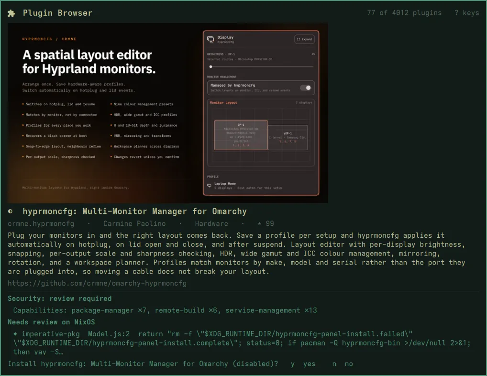

# Installing a plugin

In a plugin's details, **`i`** asks first, in the panel's footer.



`y` installs the checkout **that was audited**:

- it lands **disabled**, through `omarchy plugin add`, so nothing runs yet;
- it is pinned: the installed commit is checked against the audited one, and
  `origin` points back at the plugin's repository, so `omarchy plugin
  update` still works later;
- it never edits your bar or enables anything.

Turn it on in **Setup ▸ Plugins ▸ Enable Plugin** when you've read it, or:

```bash
omarchy plugin enable <id>
```

Installing makes the shell reload its plugins, which closes the panel. The
plugin is installed; there is just nothing left on screen to say so.

## Adding by URL

For a plugin that isn't in the marketplace, nixarchy keeps upstream's
prompt as **Setup ▸ Plugins ▸ Add Plugin from URL**. It installs whatever
the URL points at, **without** the audit. To audit it first, run the audit
from a terminal:

```bash
omarchy-plugin-audit https://github.com/acme/omarchy-weather.git
omarchy-plugin-audit https://github.com/acme/omarchy-weather.git --install
```

`c` in the panel copies a marketplace plugin's install command, if you
prefer to run it yourself. The details pane shows the exact line first
(`c copies:  omarchy plugin add https://github.com/…`); it is built from the
plugin's GitHub URL, never taken from the catalog as text.
