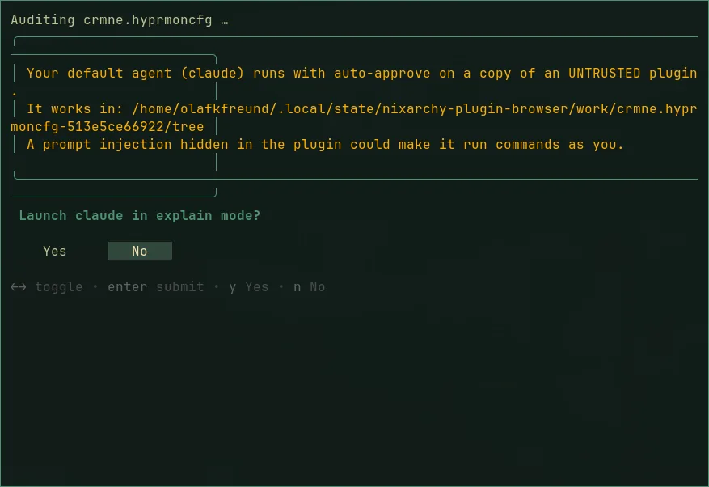

# Asking your agent

For a plugin whose NixOS verdict isn't *likely ok*, two keys in its details
bring in help (for one that is, the terminal says there is nothing to fix):

- **`e` explain:** your agent reads the audit, then explains each finding
  and the exact change it needs. It edits nothing.
- **`f` fix:** your agent edits a **copy** of the plugin. You see the diff,
  the copy is audited again, and you choose what happens next.

"Your agent" is the one you chose with `omarchy default agent`, the same one
`nixarchy ask` uses. It is told to read the `nixarchy` and `nixos-binaries`
skills first.

## Before it starts

Both keys open a terminal that runs the audit, then says plainly what is
about to happen, and asks. The answer defaults to **No**.

## What the agent gets, and what it doesn't

- A **copy** of the plugin, with no `.git`, in
  `~/.local/state/nixarchy-plugin-browser/work/<id>-<sha>/`.
- The audit report, as a **file path**. The plugin's own text never goes
  into the prompt, and the prompt tells the agent to treat every file as
  data and to ignore instructions in them.
- Instructions to install nothing, rebuild nothing, enable nothing, and
  touch nothing outside the copy. Packages the plugin needs are written down
  as `nixarchy pkg add` lines, never installed.

## After a fix

The copy is audited again, and refused if it audits worse. The patch is
saved to `~/.local/share/nixarchy-plugin-browser/patches/<id>/`. Then you
choose:

- **Install patched:** a fresh clone at the audited commit, with the patch
  committed on a local branch, scanned, and installed disabled.
- **Keep patch only.**
- **Discard.**

A patched plugin sits on a local commit, so `omarchy plugin update` stops
rather than overwriting it. Run the fix again for the new version.

## The risk that remains

The plugin is untrusted, and your agent runs with its auto-approve flags.
Everything above narrows what it is asked to do, and nothing is installed
without a second audit and your choice. But **while the agent session runs,
a prompt injection hidden in the plugin could still make it run commands as
you.** If that is not a risk you want, read the audit yourself and don't
press `e` or `f`.
