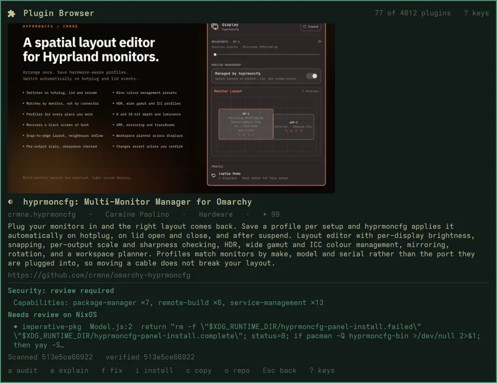
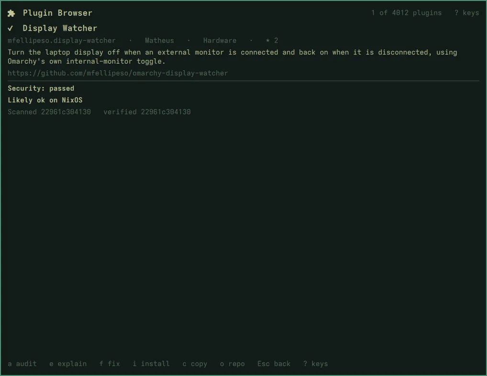

# The audit

Opening a plugin audits it. `a` runs the audit again.

## What happens

1. **The plugin is looked up** in the marketplace catalog, for its repository
   and the **commit the marketplace verified**.
2. **Dangerous URLs are refused** with the same guard `omarchy plugin add`
   uses, so a URL naming a git transport helper can't run a command.
3. **It is cloned hardened:** no symlinks, no hooks, no submodules, no
   credential prompts. It is checked out at the verified commit, and the
   report says how many commits upstream has moved past it, because that
   newer code is covered by nothing.
4. **It is scanned inside bubblewrap:**
   - a read-only view of the checkout and of the Nix store;
   - no network, an empty home, and a cleared environment.

   Without `bwrap` the audit stops instead of running unsandboxed. The
   scanner reads files as text and **never runs plugin code**.
5. **The shell's own validator** (`omarchy-plugin-validate`) runs inside the
   same sandbox: the checks the shell makes before it will load anything.

## The security verdict

| Verdict | Meaning |
|---|---|
| **passed** | none of the checks matched |
| **review required** | it has capabilities worth reading about: installing packages, managing services, privilege, remote builds, a bundled binary |
| **needs fixes** | a finding: piping a download to a shell, unpinned remote code, dangerous sudoers lines, reading credential paths, building code from strings |

The finding names match the marketplace's own, so the two can be compared.

## The NixOS verdict

A separate verdict. It never changes the security one.

| Verdict | Meaning |
|---|---|
| **likely ok** | none of the NixOS rules matched |
| **needs review** | something that often works on NixOS, but not always |
| **blocked** | a path NixOS does not have: `/usr/share/…`, `/usr/lib/…`, `/opt/…` |

Needs-review findings name the file and line:

- an Arch package manager in the code (`pacman`, `yay`);
- writes to `/etc`;
- global `pip` or `npm` installs;
- a downloaded executable;
- a bundled binary;
- an FHS shebang or path.

nixarchy enables envfs, so `#!/bin/bash` and `/usr/bin/<cmd>` do work when
`<cmd>` is installed; that is why they are *review*, not *blocked*. Tests,
docs and Makefiles are not checked for NixOS, but they are still scanned for
security.

## What a verdict is not

Grep-grade triage. It does not follow data flow, and it does not watch the
plugin run. A `passed` verdict means nothing matched, not that nothing is
wrong. Read what you enable.
