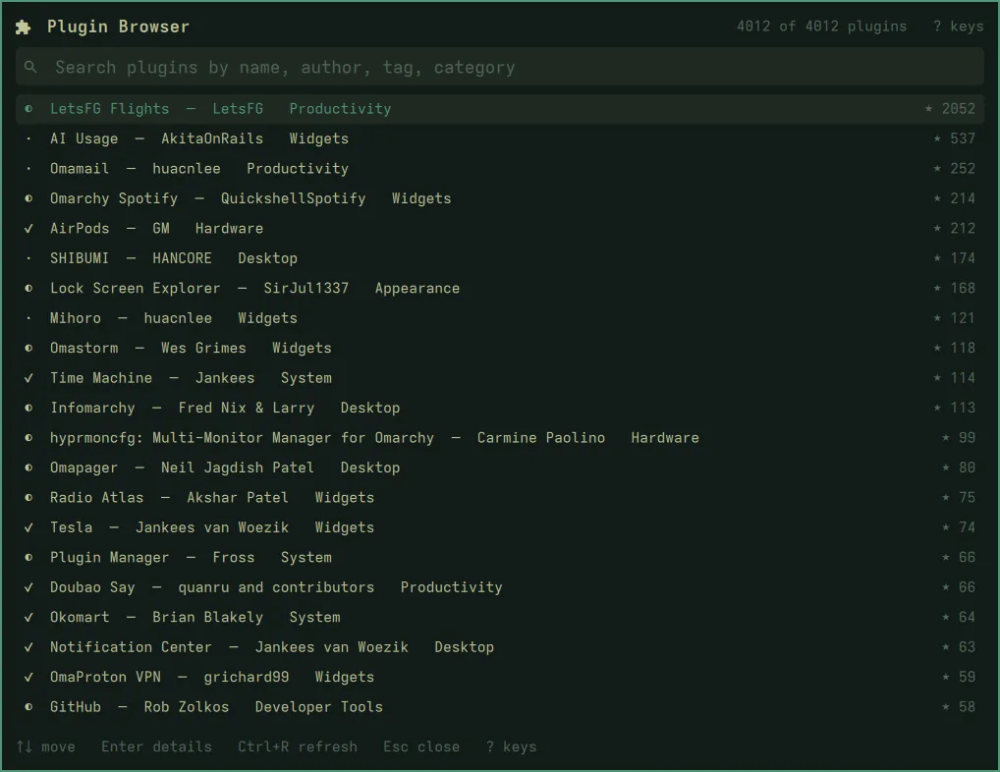
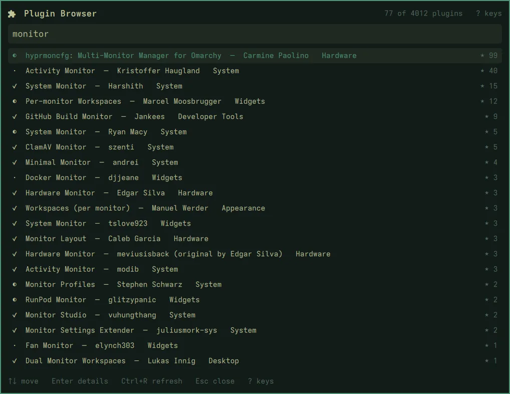
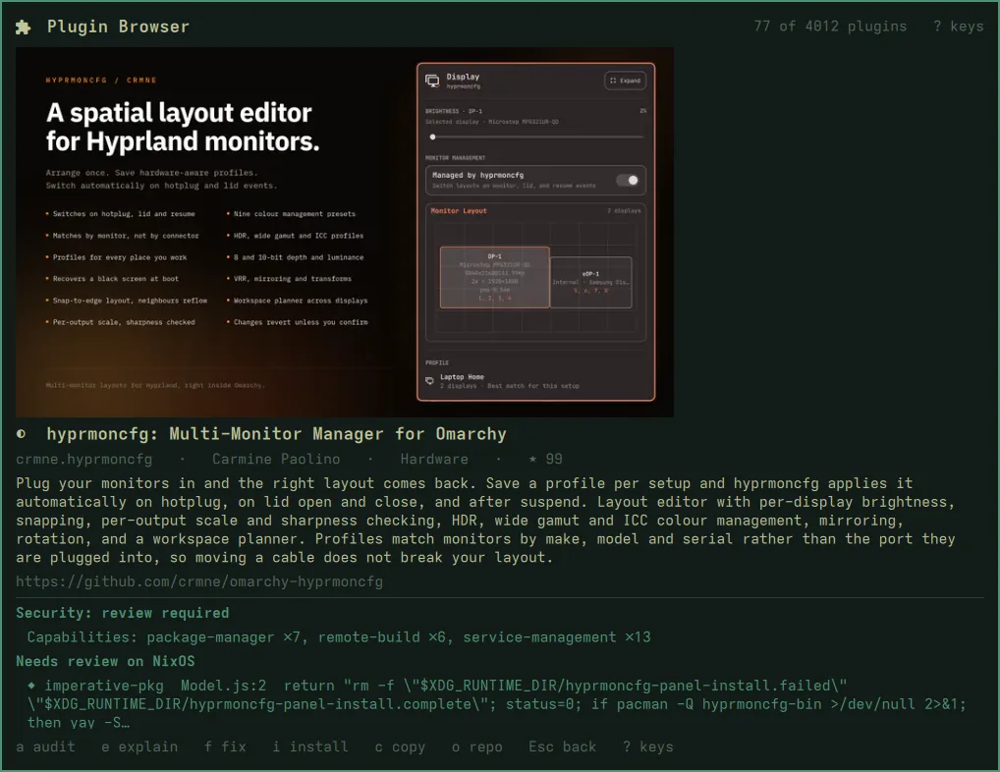
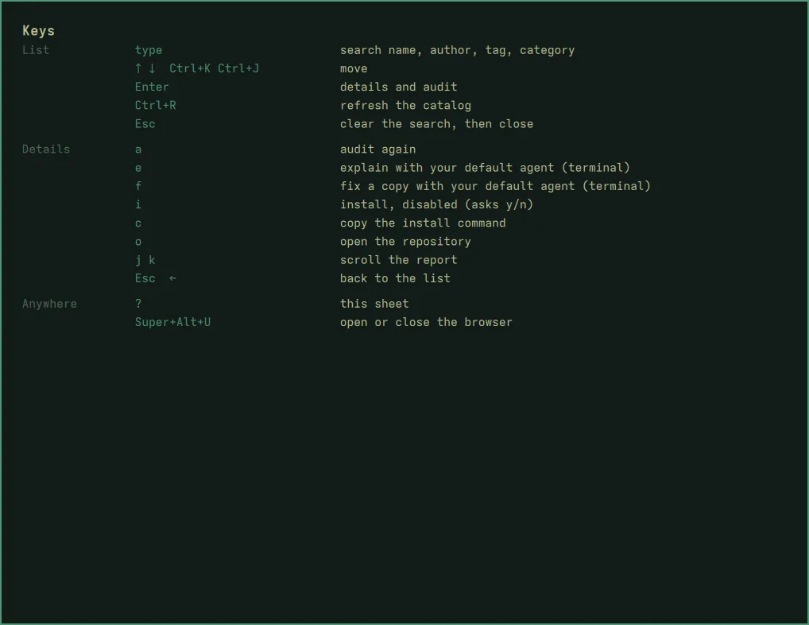

# The panel

The panel opens full-screen over what you are doing, in the desktop's own
look, and holds the keyboard until you close it, like nixarchy's other
panels.



## Finding a plugin

Type to search. The list narrows by name, id, author, category and tags as
you type; the count in the corner says how many of the catalog are shown.
Enter opens the highlighted plugin, even if you press it before the list has
caught up with your typing.



The badge before each name is the marketplace's own verification status:
`✓` verified, `◐` snapshot-verified (a newer commit is not yet checked), `·`
unverified.

## The details

Opening a plugin shows its preview image (if the marketplace has one), its
description and repository, and starts the audit. The two verdicts appear
below when the audit is done, usually in a few seconds. See
[the audit](the-audit).



## Every key

`?` shows them all, anywhere in the panel.



| Where | Keys |
|---|---|
| List | type to search · `↑` `↓` or `Ctrl+K` `Ctrl+J` to move · `Enter` for details · `Ctrl+R` to refresh the catalog · `Esc` to clear the search, then close |
| Details | `a` audit again · `e` explain / `f` fix with your agent · `i` install, disabled · `c` copy the install command shown in the pane · `o` open the repository · `j` `k` scroll · `Esc` back |
| Anywhere | `?` all keys |

`e`, `f` and `o` open a window of their own (a terminal, or your browser),
so the panel closes to let you use it.

## From a script

```bash
omarchy-shell shell toggle io.github.olafkfreund.nixarchy-plugin-browser '{}'
omarchy-shell shell toggle io.github.olafkfreund.nixarchy-plugin-browser '{"id":"crmne.hyprmoncfg"}'
omarchy-shell shell toggle io.github.olafkfreund.nixarchy-plugin-browser '{"query":"monitor"}'
```

`{"id": …}` opens that plugin's details; `{"query": …}` opens with a search
typed. On nixarchy, `nixarchy-plugin <id>` does the first, and says so if
the plugin is turned off.

## The bar button

A puzzle piece in the bar. A click opens the panel; a right click opens the
same browser as a terminal program. When a new version is out, a dot
appears on it. On a Nix install the button points you at your flake rather
than offering its own update.
